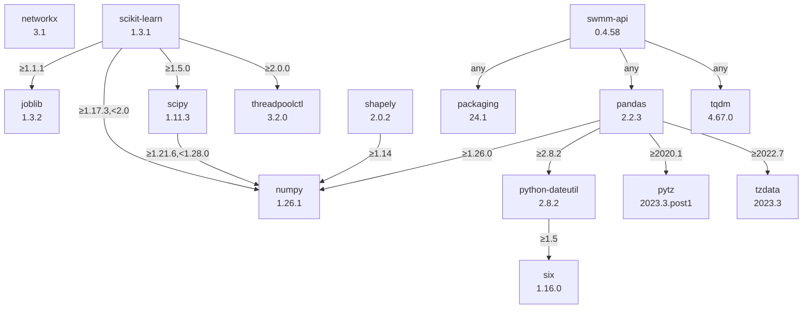

# SWMM Model Simplification

Algorithm to simplify high resolution SWMM models using the python package [`swmm-api`](https://pypi.org/project/swmm-api/).

This is the code of the algorithm publish within this scientific article:

Pichler, M., König, A. W., Reinstaller, S., & Muschalla, D. (2024). Fully automated simplification of urban drainage models on a city scale. Water Science & Technology. 

This repository is structures as followed:

- Main Script: `swmm_model_simplification.aggregate_model.aggregate_model()`
- Folder [`helpers`](swmm_model_simplification/helpers) are functions which are needed in the main script.
- Folder [`evaluation`](swmm_model_simplification/evaluation) are functions and plot to evaluate the accuracy of the simplification algorithm.
- Folder [`workflows`](swmm_model_simplification/workflows) are functions for the main sub-processes in the workflow.
- Example for model Bellinge[^1] in `example` / [`simplify_bellinge.ipynb`](example/simplify_bellinge.ipynb) or [`simplify_bellinge.py`](example/simplify_bellinge.py)
  > Note that model "Bellinge" not well suited for this application, but is used due to the availability of the model.

## Why is the code not an installable package?

Because every model is different and has its own peculiarities and therefore the script has to be adapted, which does not work with an installed package. So this code should be used as template.

[^1]: Nedergaard Pedersen, A., Wied Pedersen, J., Vigueras-Rodriguez, A., Brink-Kjær, A., Borup, M., & Steen Mikkelsen, P. (2021). The Bellinge data set: Open data and models for community-wide urban drainage systems research. Earth System Science Data, 13(10), 4779–4798. <https://doi.org/10.5194/essd-13-4779-2021>

---

The main sequence of the functions called is: 

`simplifying_model` > `consolidate_conduits` > `aggregate_subcatchments` > `calibrate_conduits` > `calibrate_subcatchments`

For documentation please read the comments in the code and the function headers.

---

## Possible extension:

- allow multiple metrics for width calibration (as function in config)
  - must replace function `calibrate_subcatchments()`

---

### Python Requirements

Packages required for this program will be installed with pip during the installation process and can be seen in the [`requirements.txt`](requirements.txt) file.

